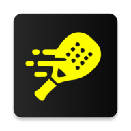

<p align="center">
  
</p>

# PadelCompanion

A padel score tracker designed for Wear OS smartwatches. Keep track of your padel match score directly from your wrist — no phone needed.

## Features

- **Full padel scoring** — Standard padel scoring with points (0, 15, 30, 40), advantage, games, sets, and tiebreaks
- **Serve tracking** — Tracks which team is serving and which side (left/right) the serve is on, alternating automatically
- **Tiebreak support** — Automatically enters tiebreak mode at 6-6 in games, with correct tiebreak scoring rules
- **Undo** — Tap to undo the last point if you made a mistake, with full state history
- **Reset** — Start a fresh match at any time
- **Always-on display** — Screen stays on during your match so you can glance at the score anytime
- **Standalone** — Runs entirely on your watch, no phone companion app required
- **Clock display** — Current time shown on the score screen so you never lose track

## How It Works

1. **Start a match** — Choose which team serves first ("Us" or "Them")
2. **Score points** — Tap the left score box to award a point to your team, or the right box for the opponents
3. **Track progress** — Sets, games, and current point score are all visible at a glance
4. **Undo or reset** — Use the top buttons to undo the last action or reset the entire match

## Tech Stack

- **Platform:** Wear OS (Android)
- **Language:** Kotlin
- **UI:** Jetpack Compose for Wear OS
- **Min SDK:** 30 (Android 11 / Wear OS 3)
- **Target SDK:** 35

## Building

Clone the repository and open it in Android Studio. Build and deploy to a Wear OS device or emulator:

```bash
./gradlew :app:installDebug
```

## Project Structure

```
app/src/main/java/com/dnodevelopment/padelcompanion/
├── MainActivity.kt              # Entry point, wires up UI and ViewModel
├── model/
│   └── PadelState.kt            # Data class for match state snapshots (undo history)
├── viewmodel/
│   └── PadelViewModel.kt        # Scoring logic, serve rotation, tiebreak rules
├── ui/components/
│   └── ScoreDisplay.kt          # All Composable UI: start screen, score board, clock
└── presentation/
    ├── MainActivity.kt           # Wear OS template entry (unused)
    └── theme/
        └── Theme.kt              # Padel-themed color palette
```

## License

MIT License — see [LICENSE.md](LICENSE.md) for details.

Copyright (c) 2025 Olivier De Neef
