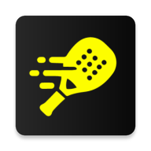
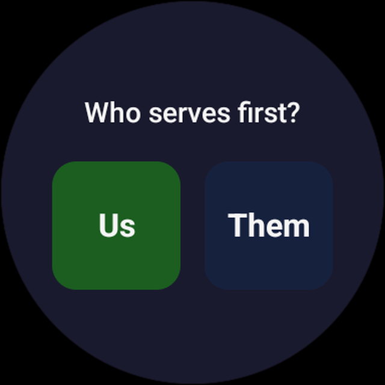
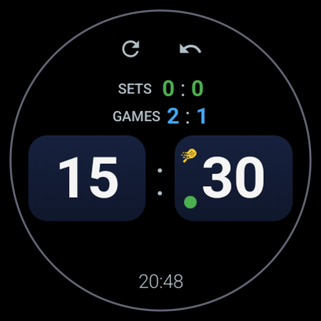
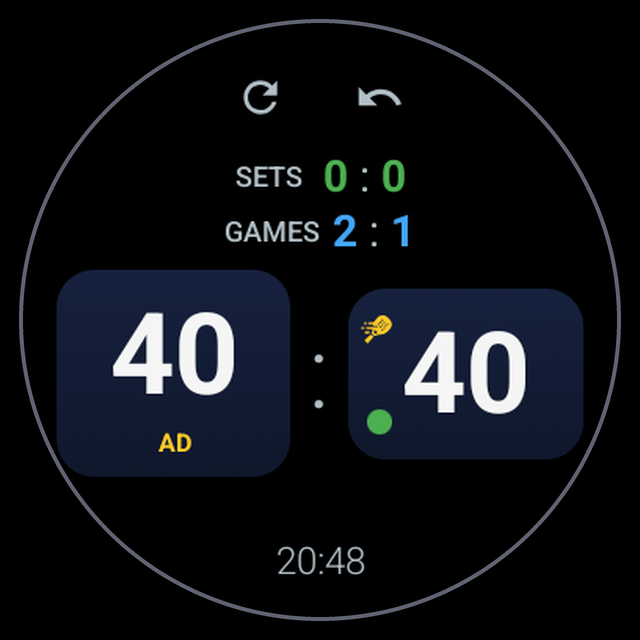
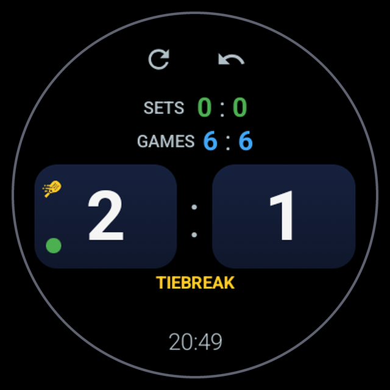
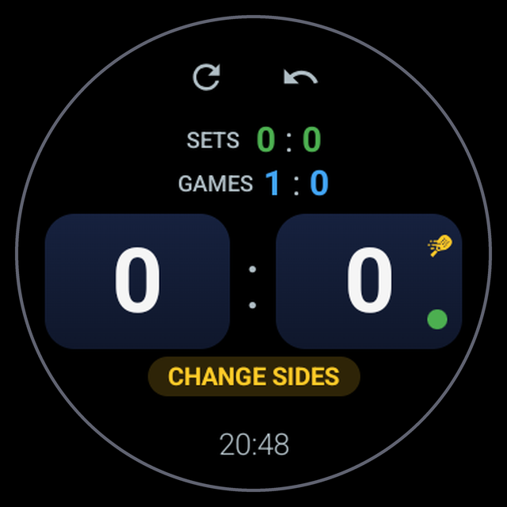

<p align="center">
  
</p>

# PadelCompanion

A padel score tracker for Wear OS smartwatches. Keep the score of your match from your wrist, with no phone needed.

[Get it on Google Play](https://play.google.com/store/apps/details?id=com.dnodevelopment.padelcompanion) · [](https://github.com/dno-ontwikkeling/padel-companion-watch/releases/latest)

<p align="center">
  
  
  
  
  
</p>

## Features

- **Full padel scoring** — Points (0, 15, 30, 40), deuce and advantage, games, and sets won 6 games with a 2-game lead
- **Tiebreaks** — Starts automatically at 6-6, played to 7 points with a 2-point lead, and shown with a TIEBREAK label
- **Serve tracking** — Shows which team is serving, which of the two partners serves (green dot), and which service box to serve from (serve icon). The box alternates every point, serve passes to the other team each game, and partners take turns across their team's service games
- **Tiebreak serve rotation** — First point by one server, then two points each, with all four players serving in rotation
- **Change sides prompt** — A CHANGE SIDES notice appears after every odd game, and every 6 points in a tiebreak
- **Undo** — Step back through every point of the match
- **Reset** — Clear the match and return to the start screen
- **Screen stays on** — The watch screen is kept on while the app is open so you can glance at the score
- **Clock** — Current time shown at the bottom of the scoreboard
- **Standalone and private** — Runs entirely on the watch. No phone app, no network access, no accounts, no data stored

## How It Works

1. **Start a match** — Choose who serves first: "Us" or "Them"
2. **Score points** — Tap the left box to give your team a point, or the right box for the opponents
3. **Follow the match** — Sets, games and the current point score are visible at a glance, along with the serve indicators and change-sides prompt
4. **Undo or reset** — Use the buttons at the top: reset (left) or undo (right)

## Tech Stack

- **Platform:** Wear OS (Android)
- **Language:** Kotlin
- **UI:** Jetpack Compose for Wear OS
- **Min SDK:** 30 (Android 11 / Wear OS 3)
- **Target SDK:** 35
- **Tests:** JUnit 4

## Building

Open the project in Android Studio, or use Gradle from the command line.

Install a debug build on a connected Wear OS device or emulator:

```bash
./gradlew :app:installDebug
```

Run the unit tests:

```bash
./gradlew :app:testDebugUnitTest
```

### Release signing

The release keystore is kept outside the repository. The build reads its location and credentials from `local.properties` in the project root:

```properties
STORE_FILE=C:/path/to/release-keystore.jks
STORE_PASSWORD=...
KEY_ALIAS=...
KEY_PASSWORD=...
```

Never commit `local.properties` or the keystore; both are ignored by `.gitignore`.

Build the signed release bundle for the Play Store:

```bash
./gradlew :app:bundleRelease
```

### Releasing

Releases are built and published by GitHub Actions:

1. Push a `fix:` (patch) or `feat:` (minor) commit to `main`. The **Release** workflow tags the next version, builds a signed `.aab` and attaches it to a GitHub pre-release. The versionCode is `major*10000 + minor*100 + patch`.
2. Run **Promote Release** from the Actions tab. It uploads that bundle to the `wear:production` track in Google Play, with the `feat:`/`fix:` commit subjects as release notes, and marks the GitHub release as latest.

The version badge above and the product page on dno-ontwikkeling.com follow the latest GitHub release.

Signing uses the repository secrets `KEYSTORE_BASE64`, `STORE_PASSWORD`, `KEY_ALIAS` and `KEY_PASSWORD`. Google Play access is keyless through Workload Identity Federation (repository variables `WIF_PROVIDER` and `PLAY_SERVICE_ACCOUNT`).

## Project Structure

```
app/src/main/java/com/dnodevelopment/padelcompanion/
├── MainActivity.kt              # Entry point: wires the ViewModel to the UI and keeps the screen on
├── model/
│   └── PadelState.kt            # Snapshot of the match state, used for undo history
├── viewmodel/
│   └── PadelViewModel.kt        # Scoring, serve rotation, tiebreak and change-sides rules
├── ui/components/
│   └── ScoreDisplay.kt          # Composables: start screen, scoreboard, serve indicators, clock
└── presentation/
    ├── MainActivity.kt          # Wear OS template entry (unused)
    └── theme/
        └── Theme.kt             # Colour palette (pure black background for Wear OS quality rules)

app/src/main/res/drawable/
└── ic_serve_indicator.xml       # Service box icon

app/src/test/java/com/dnodevelopment/padelcompanion/viewmodel/
└── PadelViewModelTest.kt        # Unit tests for serve rotation, tiebreaks, change sides and undo

resources/
├── Screenshots/                 # Play Store screenshots
├── feature-graphic.png          # Play Store feature graphic
└── privacy-policy.html          # Privacy policy linked from the Play Store listing
```

## Privacy

PadelCompanion collects no data. See the [privacy policy](resources/privacy-policy.html).

## License

Proprietary. All rights reserved. See [LICENSE.md](LICENSE.md).

Copyright (c) 2025 Olivier De Neef
